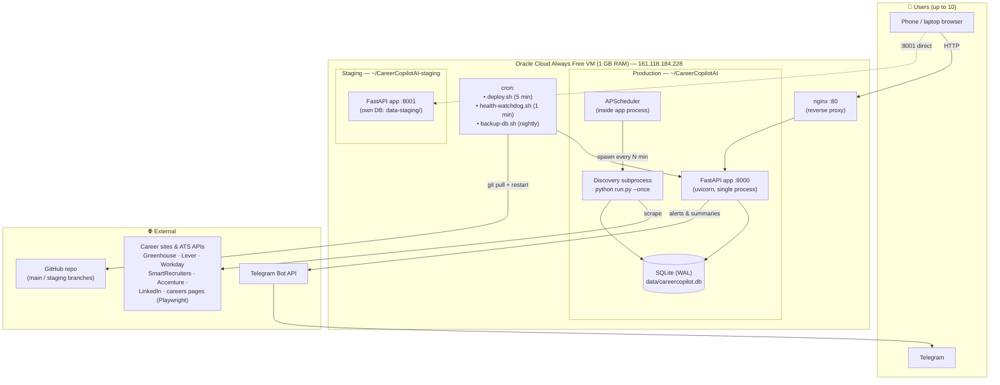
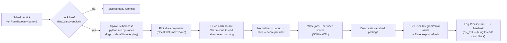
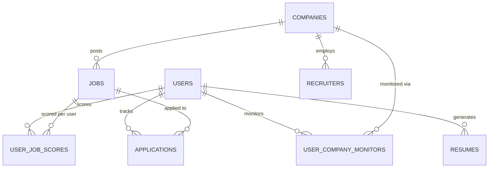
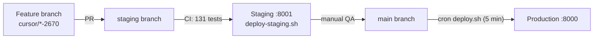

# CareerCopilot AI — System Architecture Guide

One document to understand the whole system: components, data flow, background jobs, deployment, and operations. Ends with a summary map of every feature, URL, and script.

---

## 1. Big picture

**Design constraints that shape everything:**

| Constraint | Consequence |
|---|---|
| 1 GB RAM VM | Discovery runs in a separate subprocess; batch limits; Playwright is the #1 OOM risk |
| SQLite (single file) | WAL mode + per-connection 30s busy timeout; discovery writes can still briefly block |
| Single uvicorn worker | One slow request affects others; heavy work must never run in the web process |
| Free tier, no load balancer | nginx on the same box; watchdog cron is the "self-healing" layer |

---

## 2. Components

### 2.1 Web application (`app/`)

| Module | Responsibility |
|---|---|
| `main.py` | App factory; middleware + error-handler wiring |
| `auth.py` | Session-cookie auth middleware (HMAC tokens); DB-busy retry page |
| `error_shield.py` | **Outermost** catch-all: logs traceback to `data/errors.log`, exposes last error at `/api/health` |
| `error_handlers.py` | Friendly 404/500 pages; 401 → login redirect |
| `routers/pages.py` | All server-rendered pages (dashboard, jobs, tracker, companies, admin…) |
| `routers/api.py` | JSON API under `/api` (same features, scriptable) |
| `users.py` / `deps.py` | Accounts, PBKDF2 passwords, roles (admin/member), session tokens |
| `user_access.py` | **Per-user data isolation**: monitors, scores, ownership checks |
| `user_prefs.py` | Per-user profile/notifications/scoring stored as JSON on the user row |
| `analytics.py` | Dashboard stats via SQL aggregates (NULL-safe) |
| `scheduler.py` | APScheduler jobs (see §4) |
| `ops.py` | System status snapshot, DB backup, admin error alerts |

**Middleware order (outer → inner):** `ErrorShield → Auth → FastAPI exception handlers → routes`. Anything that crashes anywhere still returns a friendly page and gets logged.

### 2.2 Discovery pipeline (`app/pipeline.py` + `app/sources/`)

Key safety rails:

- **Lock file** (`data/.discovery.lock` with PID) — one run at a time; stale PID auto-clears
- **Per-source timeout** (60s) — a hung careers page can't stall the batch
- **Hard exit** — abandoned hung threads cannot keep the subprocess alive
- **Watchdog kill** — any `run.py --once` older than 45 min is force-killed, lock cleared
- **Batch cap** (`max_sources_per_run: 15`) — protects RAM; remaining companies go next cycle

### 2.3 Source connectors (`app/sources/`)

| Connector | Method | Notes |
|---|---|---|
| greenhouse, lever, smartrecruiters | Public JSON APIs | Cheap and reliable |
| workday | JSON API (host/tenant/site) | Reliable |
| accenture | Public JSON API | Reliable |
| linkedin | Public jobs search HTML | Rate-limit sensitive |
| careers_page | httpx or **Playwright** (render: true) | Heaviest; the usual hang/OOM suspect |
| crawl4ai | Optional Docker sidecar | Disabled on 1 GB VMs |

### 2.4 Data model (core tables)

**Privacy model:** `jobs` and `companies` are shared (scraped once); everything personal — scores, applications, CV, resumes, preferences, notifications — hangs off `user_id`. Members never see other members' data; admins manage accounts but cannot read members' CVs/applications through the UI.

---

## 3. Request lifecycle (what happens when you log in)

1. `POST /login` → verify PBKDF2 hash → set signed HMAC cookie (30 days). `last_login_at` write is best-effort (a busy DB cannot fail login).
2. `GET /` → **ErrorShield** → **Auth middleware** (validates cookie, loads user; on SQLite-locked returns an auto-retrying "One moment…" page instead of crashing).
3. Dashboard route runs analytics (SQL aggregates), recent jobs (with eager-loaded company rows), journey status, poll timestamps.
4. Jinja renders. Template-time crashes are impossible to leak as raw errors — ErrorShield catches render-phase failures too.

---

## 4. Background jobs

| Job | Schedule | Where |
|---|---|---|
| Discovery | Auto-interval: ~3 polls/company/day, min 60 min, max 6 h (44 companies → runs every ~60–90 min, 15 companies per batch) | APScheduler → subprocess |
| Daily summary | 08:30 (configurable, per-user opt-out) | APScheduler in-process |
| Follow-up reminders | 09:00 daily | APScheduler in-process |
| Weekly summary | Sunday 09:30 | APScheduler in-process |
| Auto-deploy | Every 5 min (cron) | `scripts/deploy.sh` |
| Health watchdog | Every 1 min (cron) | `scripts/health-watchdog.sh` |
| DB backup | 03:15 nightly (cron) | `scripts/backup-db.sh` (keeps 14) |

`telegram=False, email=False` in the activity log means the summary ran but **no channel is configured** for that user: they need `notifications.telegram.bot_token` in `config/settings.yaml` (server-wide) *and* their chat ID in Settings; or an email + SMTP config.

---

## 5. Deployment & self-healing

**The zombie-process lesson (July 2026 outage):** a stray process once held port 8000 through every deploy — files updated, health checks passed (they read the `REVISION` file), but day-old code kept serving. Defences now:

1. `/api/version` reports **`runtime_revision`** — captured at process start, cannot lie
2. `deploy.sh` verifies runtime == deployed after restart, force-kills on mismatch
3. Watchdog compares them **every minute** and `fuser -k`s the port holder if stale

**Watchdog** (`health-watchdog.sh`, every minute) also: restarts the app if `/api/version` stops responding; kills discovery subprocesses stuck > 45 min plus orphaned Chromium; clears stale locks.

**Rollback:** `git reset --hard <sha> && bash scripts/deploy.sh` on the VM, or restore a DB file from `data/backups/`.

---

## 6. Why discovery was getting stuck (fixed)

Your activity log showed `Discovery started: 44 companies due` repeatedly with no `Pipeline run:` completion. Root cause found in code:

The per-source timeout used `with ThreadPoolExecutor(...)`. When a fetch (usually Playwright on a JS careers page) hung, the timeout fired correctly — **but leaving the `with` block calls `shutdown(wait=True)`, which blocks forever waiting on that same hung fetch.** The subprocess froze after logging "Discovery started", was eventually OOM-killed, the lock cleared, and the next cycle repeated the loop.

Fixes shipped:

1. Executor no longer waits on hung threads (`shutdown(wait=False, cancel_futures=True)`)
2. `run.py --once` ends with `os._exit()` so abandoned threads can't block process exit
3. Watchdog force-kills any discovery process older than 45 minutes as a backstop

---

## 7. Summary map

### Pages

| URL | Feature | Who |
|---|---|---|
| `/` | Dashboard: journey, stats, matches, quick filters | All |
| `/jobs` · `/jobs/{id}` | Job list (filters/pagination) · detail + resume/cover letter/prep | All |
| `/applications` | Tracker: pipeline bar, CRUD, follow-ups | All |
| `/companies` | Monitors, catalog **Add all / Disable all**, presets, test connection | All |
| `/profile` | CV upload (PDF/DOCX/TXT), parsed profile | All |
| `/settings` | Preferences, per-user alerts, re-score | All |
| `/help` | User guide | All |
| `/analytics` · `/recruiters` · `/activity` | Stats · recruiter book · audit log | Admin |
| `/admin/users` · `/admin/status` | Accounts · system health + manual backup | Admin |
| `/login` | Sign in | Public |

### Key API endpoints

| Endpoint | Purpose |
|---|---|
| `GET /api/version` | Deployed + **runtime** revision, uptime |
| `GET /api/health` | Liveness + last captured error |
| `POST /api/pipeline/run` | Trigger discovery (per-user rate-limited) |
| `POST /api/quick-start` | Starter pack + backfill + discovery |
| `GET /api/exports/excel/download` | Personal Excel workbook |
| `POST /api/resumes/tailor/{job_id}` | Tailored DOCX/PDF resume |
| `GET /api/admin/status` | System snapshot JSON (admin) |

### Scripts (`scripts/`)

| Script | Use |
|---|---|
| `deploy.sh` | Pull + install + restart + verify runtime revision (cron every 5 min) |
| `deploy-staging.sh` | Same for staging :8001 (staging branch) |
| `health-watchdog.sh` | Every minute: liveness, zombie-kill, stuck-discovery kill |
| `promote-staging-to-production.sh` | Backup DB → pin prod to staging commit → restart |
| `setup-staging-clone.sh` | One-time staging clone on the VM |
| `backup-db.sh` | SQLite snapshot to `data/backups/` (keeps 14) |
| `tune-free-tier.sh` | Apply 1 GB limits + stop staging service |
| `recover-free-tier-vm.sh` | Full recovery: swap, kill stuck things, redeploy |
| `setup-https.sh` | Let's Encrypt TLS (needs a domain — see `docs/HTTPS-SETUP.md`) |
| `run-discovery-now.sh` | Manual foreground discovery with visible output |

### Data files on the VM

| Path | Contents |
|---|---|
| `data/careercopilot.db` | Main SQLite database |
| `data/users/<id>/` | Per-user CV, resumes, exports |
| `data/backups/` | Nightly DB snapshots (last 14) |
| `data/discovery.log` | Discovery subprocess output |
| `data/errors.log` | Full tracebacks from ErrorShield |
| `data/watchdog.log` | Watchdog actions |
| `data/.discovery.lock` | PID of the running discovery |

### Ops quick reference

| Symptom | First move |
|---|---|
| Site down / 502 | Wait 1–2 min (watchdog) → `sudo systemctl restart careercopilot` |
| Error page after login | `curl http://161.118.184.228/api/health` → shows exact error type |
| Discovery seems stuck | Wait ≤ 45 min (watchdog kills it) → `tail -30 data/discovery.log` |
| Deploy didn't take effect | `/api/version` → compare `revision` vs `runtime_revision` |
| No Telegram alerts | Bot token in `settings.yaml` + your chat ID in Settings → "Send test alert" |
| VM sluggish | `bash scripts/tune-free-tier.sh` (stops staging, applies limits) |
