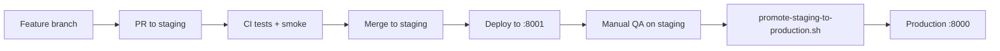

# Staging → production workflow

Use a **cloned staging instance** on the same VM to test Tier 1–5 features before they touch live users on port 8000.

## Architecture

| Environment | Directory | Port | Branch | URL |
|-------------|-----------|------|--------|-----|
| **Production** | `~/CareerCopilotAI` | 8000 | `main` | `http://YOUR_IP/` |
| **Staging** | `~/CareerCopilotAI-staging` | 8001 | `staging` | `http://YOUR_IP:8001/` |

Staging has its **own SQLite database** (`data-staging/`) — member test accounts do not affect production data.

## One-time setup (Oracle Console SSH)

```bash
cd ~/CareerCopilotAI
git pull
bash scripts/setup-staging-clone.sh
```

Open **http://YOUR_IP:8001/** and sign in (bootstrap admin uses the same legacy password as production settings).

### Firewall

Oracle Cloud security list must allow **TCP 8001** if you test staging from your phone. Production stays on port 80 → 8000.

## Daily development flow



1. **Develop** on `cursor/your-feature-2670`
2. **Open PR → `staging`** (not `main` first)
3. **CI** runs `pytest` + smoke tests automatically
4. **Merge to `staging`** → pull on VM staging clone:

   ```bash
   cd ~/CareerCopilotAI-staging
   git fetch origin staging && git reset --hard origin/staging
   bash scripts/deploy.sh
   ```

5. **Test** on `http://YOUR_IP:8001/` with real phones / Telegram
6. **Promote** when satisfied:

   ```bash
   bash ~/CareerCopilotAI-staging/scripts/promote-staging-to-production.sh
   ```

   This backs up production DB, copies staging’s git commit to production, and restarts port 8000.

## What CI blocks

- Unit tests (`tests/`)
- Smoke tests: login → dashboard → jobs, tracker, companies, profile, settings, help, admin status

A regression like the dashboard 500 after login **fails CI** before merge.

## Backups

Production DB backup (manual or cron):

```bash
bash ~/CareerCopilotAI/scripts/backup-db.sh
```

Files: `data/backups/careercopilot-YYYYMMDD-HHMMSS.db` (last 14 kept).

## Rollback

If production breaks after promote:

```bash
cd ~/CareerCopilotAI
git fetch origin
git reset --hard PREVIOUS_COMMIT_SHA
bash scripts/deploy.sh
```

Or restore DB from `data/backups/`.

## Branch policy

| Branch | Purpose |
|--------|---------|
| `cursor/*-2670` | Agent / feature work |
| `staging` | Integrated pre-production (deploys to :8001) |
| `main` | Production only (deploys to :8000) |

**Never push untested changes directly to `main`.**
